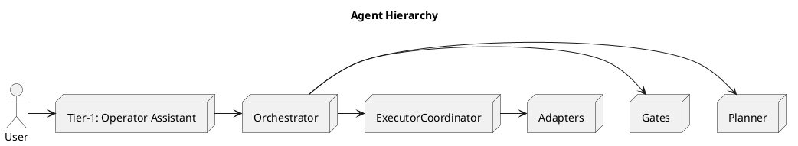
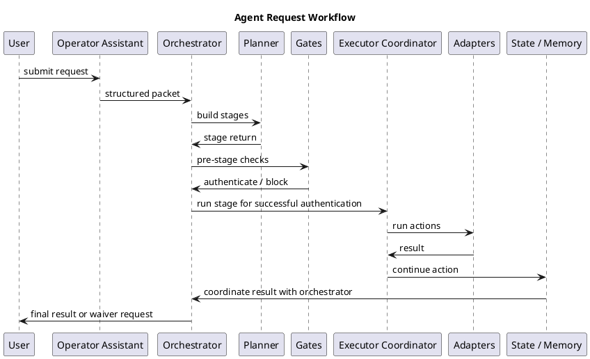

# Agentic AI Architecture — Summary

This document concisely describes the runtime agentic architecture, key agents, hierarchy, hybrid content division (executables vs markdown), and guardrails. It includes compact ASCII diagrams and PlantUML sources for rendering diagrams.

## 1 — High-level overview
- Purpose: supervised, local-first orchestration of agentic workflows. The `Orchestrator` accepts structured requests, delegates to Tier‑1 specialists, enforces policy and gates, and coordinates executors/adapters that perform actions.
- Built-in auditability: run-state persistence and request logs.

## 2 — Orchestrator & Tier‑1 hierarchy
- `Orchestrator` (runtime/orchestrator.py): central coordinator, policy enforcer, and result aggregator.
- Tier‑1 agents (first-line specialists):
  - `Operator Assistant` (runtime/operator_assistant.py): front-door intent classifier; turns user input into structured packets.
  - `Planner` (runtime/planner.py): stage/template authoring and scheduling.
  - `Gates/Validator` (runtime/gates.py, runtime/policies.yaml): schema and policy enforcement, waivers.
  - `Executor Coordinator` (runtime/executor.py): dispatch to adapters, manage retries and lifecycle.

Hierarchy (ASCII):

```
Orchestrator
  |
  +-- Operator Assistant
  +-- Planner
  +-- Gates / Validator
  +-- Executor Coordinator
       +-- Adapters / Executors
```

PlantUML (hierarchy):



## 3 — Agents and responsibilities (quick map)
- `Operator Assistant`: front-door UX and intent normalization, clarifying questions, structured packet creation.
- `Planner`: converts intent into staged plans using `runtime/stage_templates.yaml` and `runtime/planner.py`.
- `Gates/Validator`: enforces policy, schema checks, and waivers (`runtime/gates.py`, `runtime/waivers.py`).
- `Executor`: runs tasks, manages errors and retries (`runtime/executor.py`).
- `Adapters`: local-model and tool adapters, e.g., `runtime/adapters/ollama.py`.
- `State/Memories`: `runtime/state.py`, `runtime/memory_writer.py` persist run-state and logs; repo-level logs in `Docs/agent_logs/REQUEST_LOG.md`.
- `Playbooks / Prompts`: `.github/agents/*.md` and `Docs/*.md` provide human-authored prompts, guidelines, and runbooks.

## 4 — Request/workflow (flow description)
- Flow: User → Operator Assistant → Orchestrator → Planner → Stage Template → Gates → Executor Coordinator → Adapter/Tool → State/Logs → Orchestrator → User

ASCII flow:

```
[User] -> [Operator Assistant] -> [Orchestrator]
[Orchestrator] -> [Planner] -> [Stage Template]
[Stage Template] -> [Gates] -> [Executor Coordinator] -> [Adapter / Tool]
Result -> [State / Memory Writer] -> [Orchestrator] -> [User]
```

PlantUML (workflow):



## 5 — Executable vs Markdown (hybrid model)
- Executable layer: everything in `runtime/` (orchestrator, planner, gates, executor, adapters) — authoritative enforcement and action.
- Markdown/playbooks: prompts, runbooks, and agent instructions live in `Docs/` and `.github/agents/` (for example `.github/agents/nanoporethon-runtime-architecture.agent.md` and `.github/instructions/nanopore-agent-workflow.instructions.md`).
- Rule: operational changes that affect runtime contracts require code + tests + docs updates; wording/strategy changes can be iterated in `.md` playbooks first.

## 6 — Guardrails and safety controls
- Policy & schemas: `runtime/policies.yaml`, JSON schemas and `runtime/gates.py` enforce allowed actions and packet structure.
- Waivers & approvals: `runtime/waivers.py` and gate logic require operator approval for sensitive actions.
- Local-first principle: adapters default to local-only; external connectivity requires explicit opt-in.
- Audit & replay: `runtime/state.py`, `runtime/memory_writer.py`, and `Docs/agent_logs/REQUEST_LOG.md` store artifacts and provide review evidence.
- Tests & change control: repository policy requires updating tests and docs alongside behavior-changing code.
- Fail-safe behavior: executors surface structured error/blocked states; orchestrator can halt, request human intervention, or roll back.

## 7 — Quick anchors
- Orchestrator & runtime: [runtime/orchestrator.py](runtime/orchestrator.py), [runtime/planner.py](runtime/planner.py), [runtime/executor.py](runtime/executor.py)
- Policies & gates: [runtime/gates.py](runtime/gates.py), [runtime/policies.yaml](runtime/policies.yaml)
- Agent playbooks: [.github/agents/nanoporethon-runtime-architecture.agent.md](.github/agents/nanoporethon-runtime-architecture.agent.md)
- Docs & logs: [Docs/components.md](Docs/components.md), [Docs/agent_logs/REQUEST_LOG.md](Docs/agent_logs/REQUEST_LOG.md)

---
Generated: concise architecture summary and two renderable PlantUML diagrams.
