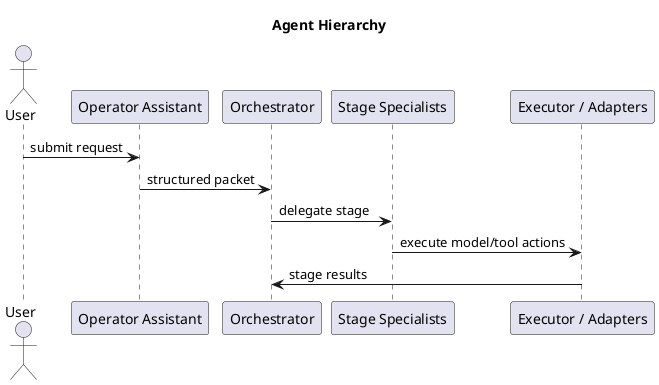
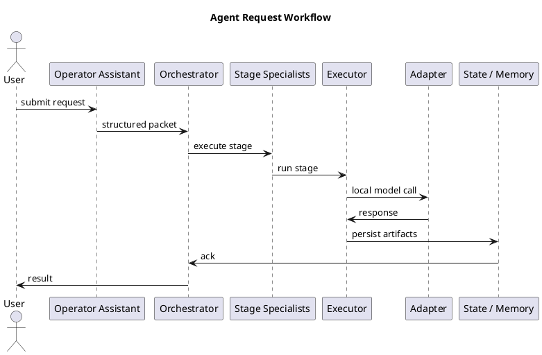

# Agentic AI Architecture — Summary

This document concisely describes the repo’s runtime agentic architecture, the actual specialist and stage hierarchy, the hybrid executable/markdown split, and the built-in guardrails.

## 1 — High-level overview
- The architecture is a policy-driven runtime spine with a central `Orchestrator` that coordinates staged execution, gate checks, approvals, and result aggregation.
- A separate `Operator Assistant` is the attended front-door for user input and intent classification, while the orchestrator itself runs the milestone stages independently.
- The system is local-first: model calls are routed through adapter code in `runtime/adapters/`, and the orchestrator persists audit state and artifacts in a run directory.

## 2 — Orchestrator & specialist hierarchy
- `Orchestrator` (`runtime/orchestrator.py`): the runtime brain that initializes runs, enforces workspace guardrails, iterates policy stages, evaluates gates, writes state, and completes or halts runs.
- User-facing `Operator Assistant` (`runtime/operator_assistant.py`): an optional attended entrypoint for request parsing, clarifications, and preflight guidance.
- Stage specialist owners are defined in `runtime/policies.yaml` under `stages` and `specialists`. The orchestrator delegates each stage to the configured owner.
- Specialist owners in this repo include:
  - `orchestrator` (`triage_plan`, `refactor_or_docsync`, `closeout`)
  - `feature_builder` (`implement`)
  - `verifier` (`verify`, `verify_after_refactor`)
  - `refactor` (`refactor`)
  - `doc_sync` (`doc_sync`)
  - `memory_sync` (`memory_sync`)
- `Executor` (`runtime/executor.py` / `SpecialistExecutor`): deterministic stage executor that loads specialist prompts, runs model calls, applies actions, and writes artifacts.
- `Adapters` (`runtime/adapters/ollama.py`): model/tool connectors used by the executor to call a local backend.

Hierarchy (ASCII):

```
User-facing layer
  |
  +-- Operator Assistant (optional front-door)
  |
Runtime spine
  |
  +-- Orchestrator
        |
        +-- Stage specialists: orchestrator, feature_builder, verifier, refactor, doc_sync, memory_sync
        |
        +-- Executor / Model adapters
```

PlantUML (hierarchy):



## 3 — Agents and responsibilities
- `Operator Assistant`: local front-door agent for attended workflows, intent classification, scope checks, clarifying questions, and grounding against repo docs.
- `Orchestrator`: run lifecycle management, policy interpretation, stage traversal, gate evaluation, approval handling, state persistence, and final run status.
- `Planner` (`runtime/planner.py`): builds triage plans and stage context; it supports the `triage_plan` stage and helps the executor construct valid stage payloads.
- `Gates/Validator`: policy enforcement and schema validation via `runtime/gates.py`, `runtime/contracts.py`, and `runtime/schemas/`.
- `Specialist owners`: stage-specific runtime specialists defined in `runtime/policies.yaml`.
  - `feature_builder` creates implementation payloads and file actions.
  - `verifier` checks tests, quality signals, and coverage.
  - `refactor` proposes targeted code cleanup.
  - `doc_sync` updates docs and the request log.
  - `memory_sync` writes repository memory updates.
  - `orchestrator` handles triage, routing, and closeout stages.
- `Executor`: deterministic runtime stage executor that applies actions and invokes adapters for model-driven stages.
- `Adapters`: connectors for local model backends and tools. In this repo, `runtime/adapters/ollama.py` is the main adapter implementation.
- `State / Memory`: `runtime/state.py` and `runtime/memory_writer.py` persist run-state, events, artifacts, and memory updates. These are workflow artifacts, not the primary user-facing result.

## 4 — Request/workflow
- Typical flow:
  1. User submits a request (often through the `Operator Assistant`).
  2. The `Operator Assistant` returns a structured request packet and clarifies intent if needed.
  3. `Orchestrator.run_milestone1()` starts a run, initializes run-state, and applies workspace guardrails.
  4. The orchestrator iterates configured stages from `runtime/policies.yaml`.
  5. Each stage is executed by `SpecialistExecutor` using the owner’s specialist prompt and a local model adapter.
  6. Stage results are validated, gate evidence is evaluated, waivers are applied if needed, and state is written.
  7. The final result is returned by the orchestrator; state and memory artifacts are saved alongside it.

ASCII flow:

```
[User] -> [Operator Assistant] -> [Orchestrator]
[Orchestrator] -> [Stage Specialists] -> [Executor]
[Executor] -> [Adapter / Model]
[Executor] -> [State / Memory Writer]
[Orchestrator] -> [User]
```

PlantUML (workflow):



## 5 — Executable vs Markdown (hybrid model)
- Executable layer: core runtime behavior is implemented in `runtime/`.
  - `runtime/orchestrator.py`
  - `runtime/executor.py`
  - `runtime/gates.py`
  - `runtime/planner.py`
  - `runtime/state.py`
  - `runtime/memory_writer.py`
  - `runtime/adapters/ollama.py`
- Markdown/playbooks: operational prompts, policies, and architecture guidance live in `Docs/` and `.github/agents/`.
  - `runtime/policies.yaml`
  - `runtime/prompts/*.md`
  - `.github/agents/*.md`
  - `Docs/components.md`
  - `Docs/nanoporethon_textbook.md`
- Hybrid rule: code is authoritative for runtime contracts; markdown is authoritative for guidance, prompts, and procedural policy intent.

## 6 — Guardrails and safety controls
- `runtime/policies.yaml` defines specialist stages, model provider settings, gates, waivers, and repository guardrails.
- `runtime/gates.py` evaluates required stage checks and evidence before allowing stage continuation.
- `runtime/waivers.py` supports operator-approved overrides for blocked gates.
- `runtime/state.py` tracks run metadata, current stage, approval mode, and status.
- `runtime/memory_writer.py` adds persistent memory updates and reusable patterns.
- `runtime/adapters/ollama.py` keeps model calls local-first; external access is explicit via adapter configuration.
- Workspace guardrails enforce clean worktree expectations and sandbox inspection before execution.
- Audit trail: each stage result, gate result, waiver event, and runtime error is appended to run artifacts and logs.

## 7 — Quick anchors
- Orchestrator & runtime: [runtime/orchestrator.py](runtime/orchestrator.py), [runtime/planner.py](runtime/planner.py), [runtime/executor.py](runtime/executor.py)
- Policies & specialists: [runtime/policies.yaml](runtime/policies.yaml), [runtime/prompts/nanopore-orchestrator.prompt.md](runtime/prompts/nanopore-orchestrator.prompt.md)
- Operator assistant: [runtime/operator_assistant.py](runtime/operator_assistant.py)
- Docs & logs: [Docs/components.md](Docs/components.md), [Docs/agent_logs/REQUEST_LOG.md](Docs/agent_logs/REQUEST_LOG.md)

---
Generated: updated summary aligned with repo runtime architecture.
